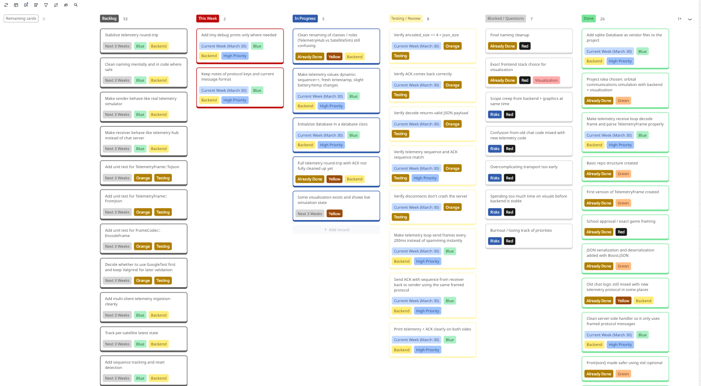

<div align="center">

# SOUL
### Secure Orbital Uplink Layer

**A C++20 telemetry and orbital communications simulation project focused on networking, ingestion, and resilience.**


</div>

> [!WARNING]
> This project is still actively evolving. The README, architecture notes, workflow details, and implementation choices will likely change over the next few weeks as the system grows.

## Overview

SOUL is a backend-first C++20 project for sending, receiving, and processing simulated satellite telemetry over TCP.

The current focus is on:

- structured telemetry frames
- length-prefixed messaging
- a telemetry sender and receiver
- SQLite-backed packet storage work
- keeping the project organized with clear planning and documentation

## Current Status

The current codebase includes:

- `Server/` for the telemetry receiver/server and acknowledgement path
- `Hub/` for the telemetry sender/client
- `Common/` for shared telemetry frame and frame codec logic
- `Database/` for the SQLite database layer being used for received-packet storage
- `scratchTests/` for temporary checks while proper unit tests are being planned

Current build targets:

- `SOUL` for the server/receiver
- `Client` for the telemetry sender/client
- `Test` for scratch validation work

## Workflow

I am using Miro to keep track of important findings, timeline planning, and kanban work so the project stays structured while the design is still changing.

- Kanban board: [docs/KanbanBoard.png](docs/KanbanBoard.png)
- Timeline view: [docs/TimeLineview.png](docs/TimeLineview.png)



## Tech Stack

- C++20
- Boost.Asio
- Boost.JSON
- SQLite
- CMake

## Documentation

- Requirements: [docs/01_requirement.md](docs/01_requirement.md)
- Protocol notes: [docs/02_protocol.md](docs/02_protocol.md)
- Architecture: [docs/03_architecture.md](docs/03_architecture.md)

## Project Structure

```text
SOUL/
|-- Common/
|-- Hub/
|-- Server/
|-- Database/
|-- scratchTests/
|-- docs/
`-- external/sqlite/
```

## Next Steps

- continue wiring SQLite into received-packet persistence
- add proper unit tests for the frame codec and telemetry flow
- expand multi-client handling and link impairment simulation
- keep refining the documentation as the implementation settles
